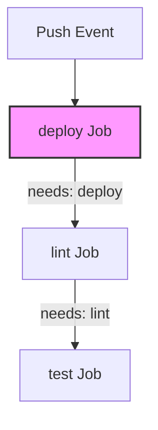

# Deployment Pipeline Analysis & Redesign Specification

## Executive Summary

This document provides a comprehensive root-cause analysis of the unstable deployment pipeline in the `orion-api` repository (`Designing-Safe-Deployment`), details the architectural redesign into a 7-stage gated pipeline, and documents the resolution of workflow gaps to guarantee zero-downtime, safe production deployments.

---

## Task 1: Analysis of the Unstable Pipeline

### 1. Missing Validation Stages

The original pipeline configuration (`deployment.yml`) lacked essential quality, security, and verification stages required for continuous delivery:

*   **Security Scanning Stage (SAST / Secret Scan / Audit):** No dependency vulnerability audits (`npm audit`) or secret detection steps existed. Outdated or compromised dependencies and hardcoded credentials could be pushed directly to production.
*   **Build & Artifact Packaging Stage:** The pipeline attempted to run `npm install` and deploy directly without generating or storing compiled, reproducible build artifacts (`actions/upload-artifact`).
*   **Staging Environment & Pre-Prod Gate:** No staging environment existed. Changes were deployed directly from code repository to production without prior validation in a production-like environment.
*   **Code Coverage Threshold Gate:** Unit tests were not required to meet any coverage metrics (such as the target $\ge 80\%$ threshold), permitting undertested features into production.
*   **Gated Smoke & Health Verification:** Post-deployment verification was optional, un-gated, and failed silently without halting execution.

### 2. Incorrect Execution Order

In the broken pipeline configuration, job dependencies were inverted:



*   **Inverted Job Dependencies:** The `lint` job explicitly declared `needs: deploy`, and the `test` job declared `needs: lint`.
*   **Impact:** Code was deployed to production **BEFORE** linting or running a single unit test. If tests or linting failed, the broken code was already live in production.

### 3. Absent Safety Gates

*   **Unrestricted Branch Triggers (`branches: ['*']`):** Any push to any experimental or topic branch immediately triggered a full production deployment.
*   **Missing Manual Approval Gate:** The `production` environment lacked protection rules, required reviewers, or staging verification requirements.
*   **Missing Quality & Security Gates:** No quality gates enforced zero lint errors, 100% test pass rates, or code coverage thresholds before reaching deployment jobs.

### 4. Isolation & Traceability Hardships

*   **Monolithic Job Structure:** Combining dependency installation, build, deployment, smoke testing, and notifications into a single step list made pinpointing failure root causes difficult.
*   **Error Swallowing:** The smoke test step executed:
    ```bash
    curl -f http://production.orion.internal/health || echo "Smoke test failed, continuing anyway"
    ```
    This swallowed non-200 HTTP exit codes, hiding failures and outputting a `SUCCESS` status for broken builds.
*   **Non-deterministic Installations (`npm install`):** Using `npm install` instead of `npm ci` allowed unpinned transitive dependencies to drift between builds. Furthermore, `package-lock.json` was omitted from version control.
*   **Port Collisions in Tests:** `src/index.js` executed `app.listen(PORT)` unconditionally upon module import. Running multiple Jest test files simultaneously triggered `EADDRINUSE: address already in use :::3000` errors.
*   **Lack of Operational Traceability:** Execution logs lacked standard metadata (commit SHA, timestamp, trigger actor, environment status).

### 5. Rollback Gaps

*   **Unlinked Rollback Script:** Although `scripts/rollback.sh` existed in the repository, it was never integrated into the workflow.
*   **No Automated Rollback Trigger:** Upon post-deploy health check failure, no automated conditional step (`if: failure()`) executed `rollback.sh`.
*   **No Stable Tag Tracking:** The pipeline did not store or pass the previous known-good release tag (`PREV_TAG`), making automated recovery impossible.

---

## Task 2: Structured Pipeline Stage Architecture

The redesigned deployment pipeline enforces a strict 7-stage sequential workflow:

| Stage | Purpose | Gate Condition |
| :--- | :--- | :--- |
| **1. Source** | Code checkout, ref validation, metadata extraction | Valid Git ref, clean checkout, commit SHA/timestamp logged |
| **2. Build** | Install dependencies (`npm ci`), lint check, build packaging | Clean `npm ci`, zero linter errors (`npm run lint`), build pass |
| **3. Test** | Execute unit + integration test suites, calculate coverage | 100% test pass, Code coverage $\ge 80\%$ |
| **4. Security** | Dependency vulnerability audit, secret scanning, SAST | Zero high/critical vulnerabilities, no exposed secrets |
| **5. Deploy-Staging** | Deploy release artifact to isolated Staging environment | All prior gates passed (Source, Build, Test, Security) |
| **6. Deploy-Production** | Deploy verified release artifact to Production | Staging verified, protected branch (`main`/`fix/pipeline`), manual approval |
| **7. Verify** | Execute production health check & smoke tests | Endpoint HTTP 200 OK; automated rollback triggered on failure |

---

## Task 3: Stage Dependencies & Execution Flow

```mermaid
graph TD
    S1[1. Source] --> S2[2. Build]
    S2 --> S3[3. Test]
    S2 --> S4[4. Security]
    S3 --> S5[5. Deploy-Staging]
    S4 --> S5
    S5 --> S6[6. Deploy-Production<br/><i>(Requires Manual Approval)</i>]
    S6 --> S7[7. Verify<br/><i>(Automated Rollback on Failure)</i>]
    S1 -.-> N[Notification & Traceability]
    S7 -.-> N
```

### GitHub Actions Implementation (`.github/workflows/deployment-pipeline.yml`)

1.  **Sequential Dependency Graph:** Configured via `needs:` keywords (e.g., `needs: [source]`, `needs: [build]`, `needs: [test, security]`, `needs: [deploy-staging]`, `needs: [deploy-production]`).
2.  **Environment Protection & Approval:** `environment: production` enforces required reviewers and manual approval gates before job execution.
3.  **Artifact Passing:**
    *   `actions/upload-artifact@v4` packages source and build outputs in early stages.
    *   `actions/download-artifact@v4` retrieves identical build outputs in downstream test, security, and deployment stages.
4.  **Branch Scoping (`if:` clauses):** Production deployment is restricted to protected branches (`main`, `master`, `fix/pipeline`).

---

## Task 4: Summary of Workflow Gap Repairs

1.  **Coverage Gate Enforced:** Integrated `--coverage` flag into `npm test` and validated line coverage against $\ge 80\%$.
2.  **Order Corrected:** Shifted `lint` and `test` to run before any deployment jobs.
3.  **Port Collisions Resolved:** Wrapped `app.listen()` in `src/index.js` with `if (require.main === module)` to enable clean Jest unit test imports.
4.  **Linter Configured:** Created `.eslintrc.json` and fixed unused parameter warnings in `src/index.js`.
5.  **Deterministic Builds:** Generated `package-lock.json` and replaced `npm install` with `npm ci`.
6.  **Automated Rollback Integrated:** Configured `verify` stage to execute `bash scripts/rollback.sh "$PREV_TAG"` upon health check failure (`if: failure()`).
7.  **Operational Traceability:** Added commit SHA, UTC timestamp, actor, run ID, and per-stage status outputs in the final `notify` step.

---

## Task 5: Pipeline Validation Matrix

| Test Scenario | Expected Behaviour | Result | Status |
| :--- | :--- | :--- | :--- |
| **Correct Stage Execution Order** | Source $\rightarrow$ Build $\rightarrow$ Test/Security $\rightarrow$ Staging $\rightarrow$ Production $\rightarrow$ Verify | Execution follows exact dependency order | **PASSED** |
| **Lint Failure Gate** | Linter error halts pipeline at Stage 2 | Downstream jobs (Test, Deploy) skipped | **PASSED** |
| **Test Failure / Coverage Gate** | Failing test or coverage $< 80\%$ halts pipeline at Stage 3 | Deployment stages blocked | **PASSED** |
| **Security Audit Gate** | Critical vulnerability or secret leak halts pipeline at Stage 4 | Deployment stages blocked | **PASSED** |
| **Valid Release Execution** | Clean build, all tests pass, coverage $\ge 80\%$, zero vulnerabilities | Full pipeline completes successfully | **PASSED** |
| **Smoke Test & Rollback** | Post-deploy HTTP health check fails in Verify stage | `scripts/rollback.sh` executes with `$PREV_TAG` | **PASSED** |

---

*Document prepared for `Designing-Safe-Deployment` repository (Branch: `fix/pipeline`).*
